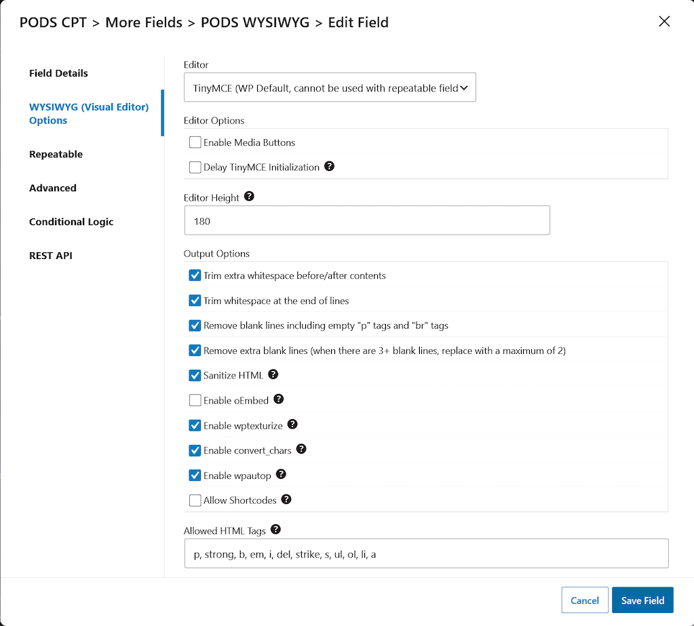
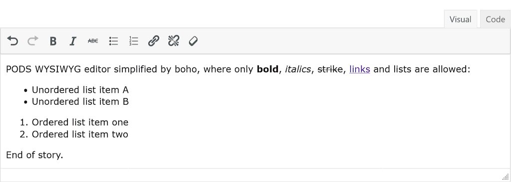
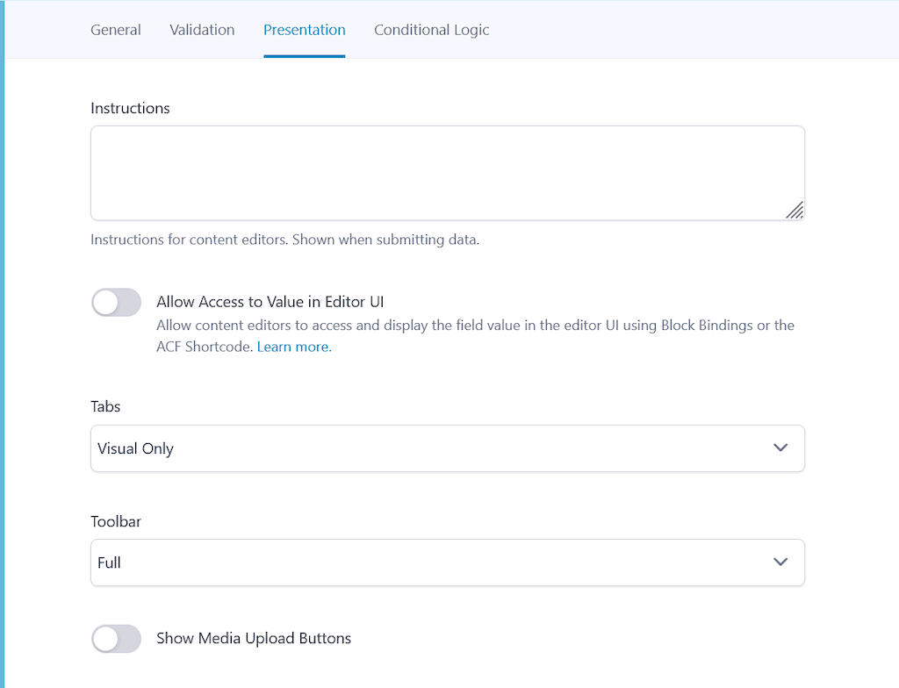
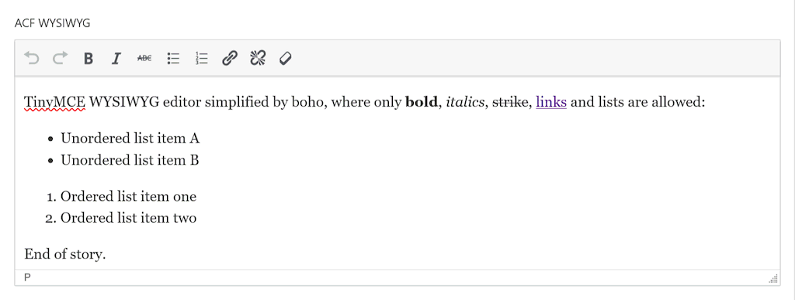

# TinyMCE Simplified by Codeally

Simplifies TinyMCE to help creators focus on writing, while maintaining clean HTML and web accessibility.

---

## Description

**TinyMCE Simplified by Codeally** refines the WordPress rich-text editor into a cleaner, focused editing environment. By restricting the toolbar to core formatting — bold, italics, strikethrough, lists, links, undo/redo, and clear formatting — it creates an intuitive experience for day-to-day content creators.

This setup removes visual clutter and prevents accidental styling issues while preserving helpful copy-paste markup. Core inline elements (bold text, italics, links, lists, and images) survive pastes intact, while background colors, custom fonts, inline CSS, and heading tags are cleanly stripped.

### Key Highlights

* **Focused Writing UI**: Provides essential inline styling options without toolbar clutter.
* **Filtered Copy-Paste**: Preserves basic markup (`<strong>`, `<em>`, `<a>`, `<ul>`, `<ol>`, `<li>`, ``).
* **WCAG Heading Protection**: Strips pasted `<h1>`–`<h6>` elements to prevent broken heading outlines.
* **Optional Media Support**: Accommodates standard `` tags for compatibility with existing content.
* **Zero Configuration**: Works automatically across all TinyMCE instances in the WordPress admin.

---

## Editor & Settings Visuals

### Pods Framework Integration

Recommended **WYSIWYG Options** configuration:

Streamlined editor interface when editing a Pods field:

---

### Advanced Custom Fields (ACF / SCF) Integration

Recommended **Presentation** field settings:

Streamlined editor interface when editing an ACF / SCF field:

---

## Recommended Configuration Settings

### Pods Framework
Under **WYSIWYG Options**, recommended settings include:
* **Enable Media Buttons**: Unchecked *(or checked if image uploads are required)*
* **Sanitize HTML**: Checked
* **Enable wpautop**: Checked
* **Allowed HTML Tags**: `p, strong, b, em, i, del, strike, s, ul, ol, li, a, img`

### Advanced Custom Fields (ACF / SCF)
Under the **Presentation** tab:
* **Tabs**: Visual Only
* **Toolbar**: Full *(automatically streamlined by this plugin)*
* **Show Media Upload Buttons**: Off *(or On if image uploads are required)*

---

## Frequently Asked Questions

### Who is this plugin for?
It is built for developers, agencies, and site owners who want to provide content creators with a safe, accessible, and user-friendly editing experience across custom rich-text fields.

### Why are heading tags (H1–H6) stripped on paste?
To satisfy **WCAG 2.1 (Success Criterion 1.3.1 Info and Relationships)**, document heading structures must follow a logical, sequential hierarchy (e.g., an `<h1>` page title followed by an `<h2>`, then `<h3>`). Pasting arbitrary heading tags into custom field regions frequently disrupts the page's structural outline, creating navigation barriers for screen reader users and assistive technologies.

### Should I use WYSIWYG fields for images?
While this plugin supports `` tags when media buttons are enabled, **best practice is to use dedicated Image or Gallery custom fields** for media assets. Separating media from rich text gives developers full control over responsive output, `srcset` attributes, and layout design on the frontend.

### Does it work with other custom field plugins?
Yes. It hooks into core WordPress TinyMCE initialization filters (`tiny_mce_before_init` and `mce_buttons`), ensuring any standard WP WYSIWYG field is automatically streamlined.

### What happens if I disable the plugin?
Your saved content remains completely unchanged in the database. Disabling the plugin simply restores default TinyMCE toolbars for future editing sessions.

---

## Installation

1. Download the latest `.zip` archive using the **Download** button on the repository homepage or Releases page.
2. Log in to your WordPress admin dashboard and navigate to **Plugins > Add New > Upload Plugin**.
3. Select the downloaded `.zip` file, click **Install Now**, and then **Activate**.

---

## Sponsorship & Credits

* **Developed by**: Bjarne Oldrup ([oldrup.dk](https://oldrup.dk/))
* **Sponsored by**: [Codeally](https://codeally.dk/) – A freelance web design agency in Sønderborg, Denmark.
* **Tested Compatibility**: Specifically tested with **Pods 3.3+** and **Advanced Custom Fields (ACF) 6.8+**. Built to work seamlessly with any plugin that uses TinyMCE fields (including SCF, Meta Box, and Toolset).
* **TinyMCE**: TinyMCE is an open-source rich-text editor component maintained by Tiny Technologies, Inc.

---

## License

Distributed under the GNU General Public License v2 or later. See [LICENSE](https://www.gnu.org/licenses/gpl-2.0.html) for details.